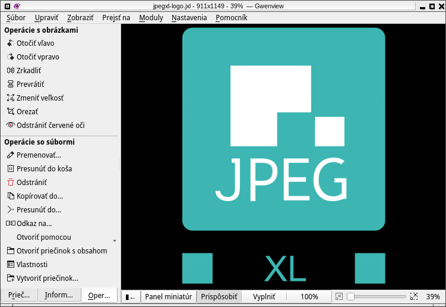
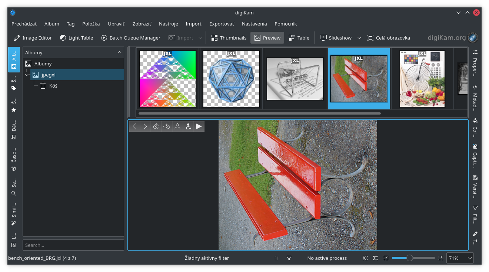
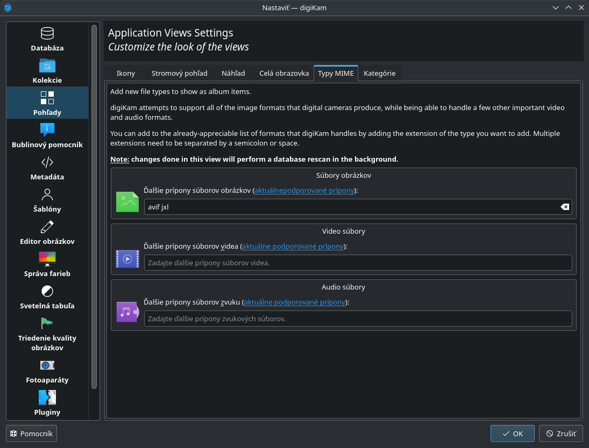
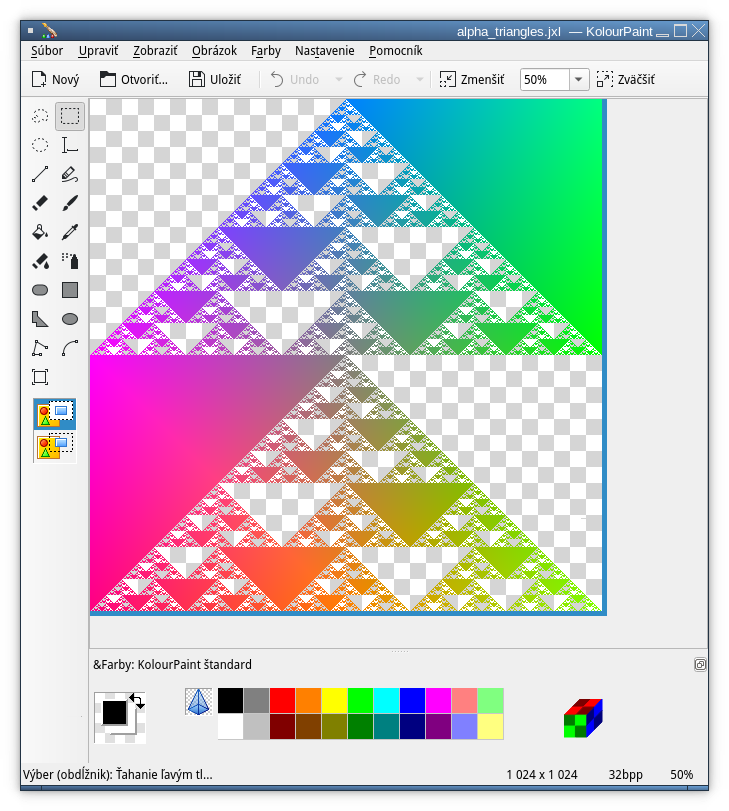
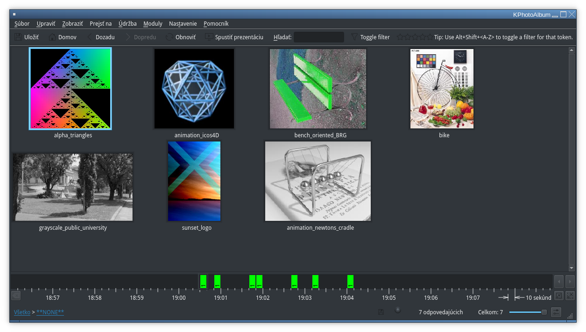
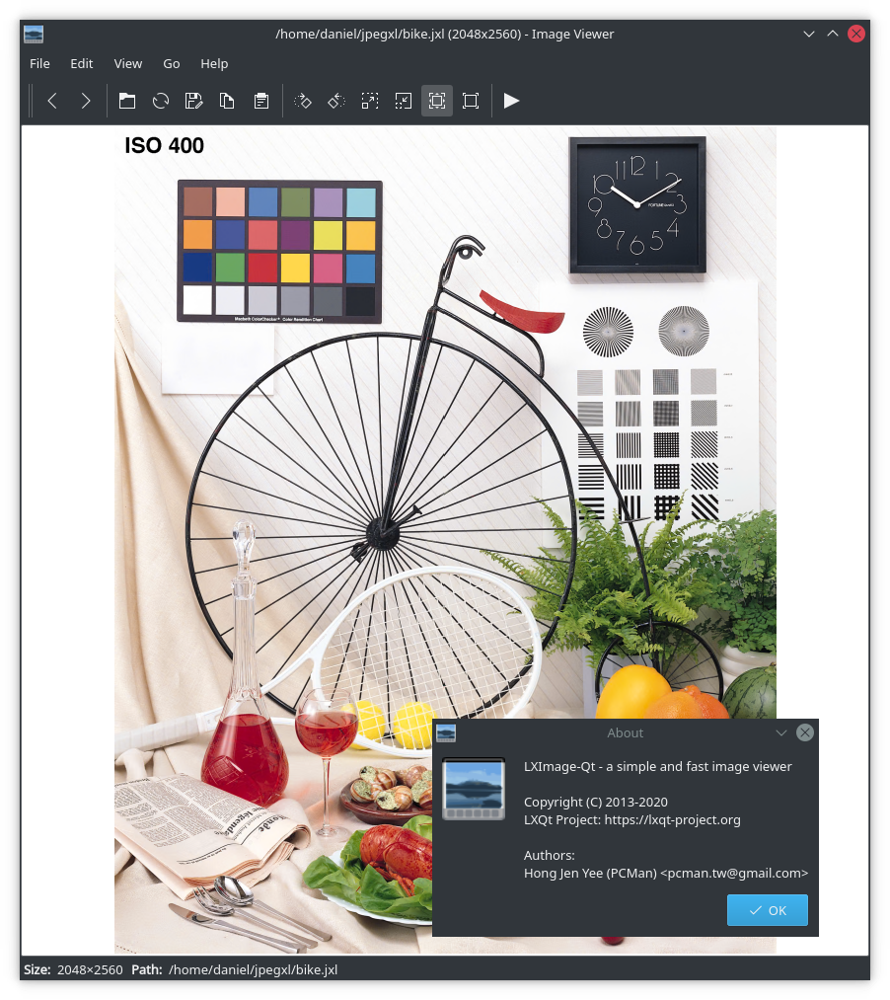
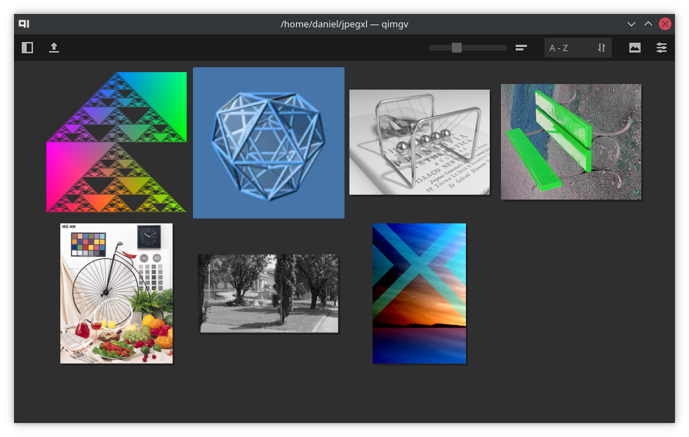
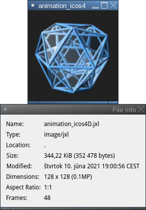
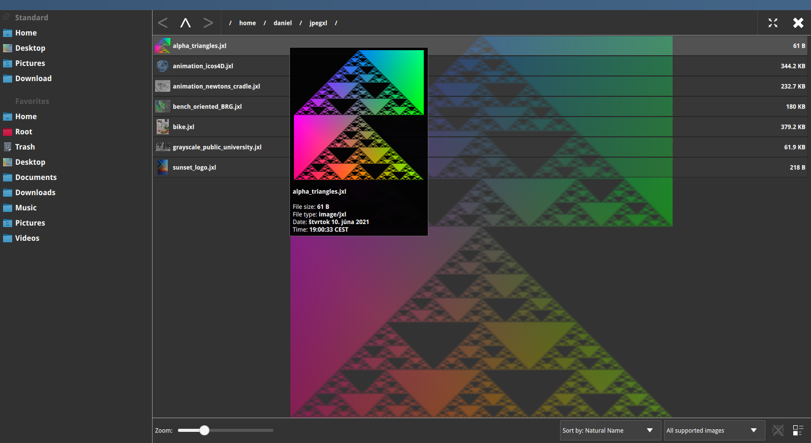
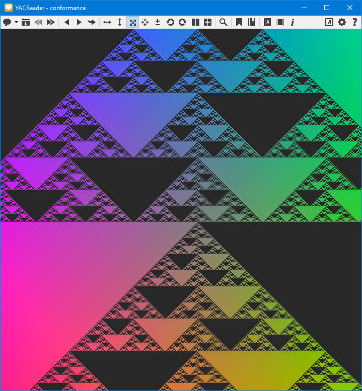

# qt-jpegxl-image-plugin

## Table of Contents

1. [Description](#Description)
2. [Installation](#Installation)
3. [Test](#Test)

# Description

Qt plug-in to allow Qt and KDE based applications to read/write JXL images.

Work in progress experimental implementation using [libjxl](https://github.com/libjxl/libjxl)

**kimageformats 5.89** contains almost identical plug-in like this one already. If you have `kimg_jxl.so` installed, don’t install qt-jpegxl-image-plugin. If your distribution maintainer built kimageformats without JPEG XL support, you may install qt-jpegxl-image-plugin. It is not recommended to have `libqjpegxl.so` and `kimg_jxl.so` installed at the same time.

# Installation

### 1. Clone, build and install JPEG-XL

**!Important!** Clone must be `--recursive` to include third party packages

Code for download and compilation:
```
git clone --depth 1 https://github.com/libjxl/libjxl.git --recursive
cd libjxl
mkdir build
cd build
cmake -DCMAKE_BUILD_TYPE=Release -DCMAKE_INSTALL_PREFIX=/usr -DJPEGXL_ENABLE_PLUGINS=ON -DBUILD_TESTING=OFF -DJPEGXL_WARNINGS_AS_ERRORS=OFF -DJPEGXL_ENABLE_SJPEG=OFF ..
make
```
Code for installation (run as root):

`make install`

### 2. Update mime database file

Check if the `image-jxl.xml` file was installed to `/usr/share/mime/packages/` folder and run (as root):

`update-mime-database /usr/share/mime/`

### 3. Build qt-jpegxl-image-plugin

Make sure that the Qt 5 base development packages (`qt5base-dev` on Debian/Ubuntu) are installed. At least Qt 5.14 is required.

Download and build:
```
git clone --depth 1 https://github.com/novomesk/qt-jpegxl-image-plugin
cd qt-jpegxl-image-plugin
./build_libqjpegxl_dynamic.sh
```
Install (run as root):

`make install`

### 4. Add `image/jxl` to `/usr/share/kservices5/imagethumbnail.desktop`

1. Open `/usr/share/kservices5/imagethumbnail.desktop` with editor of your choise
2. Find line that starts with `MimeType=` and add `image/jxl;` to it's end, so line looks like `MimeType=image/cgm; ... ;image/rle;image/avif;image/jxl;`, save file.
3. Run `update-desktop-database`

# Test
```
cd testfiles
gwenview jpegxl-logo.jxl
```

Expected result:



# Enjoy using JXL in applications

### digiKam


JPEG XL support has to be explicitly enabled in digiKam. Go to Settings -> Configure digikam -> Views -> Mime Types and add `jxl` to the to the Additional image file extensions field:


### KolourPaint


### KPhotoAlbum


### LXImage-Qt


### qimgv


### qView


### PhotoQt


### YACReader

